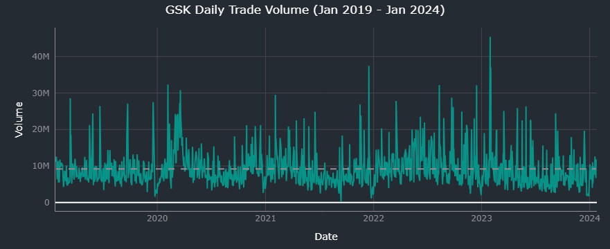
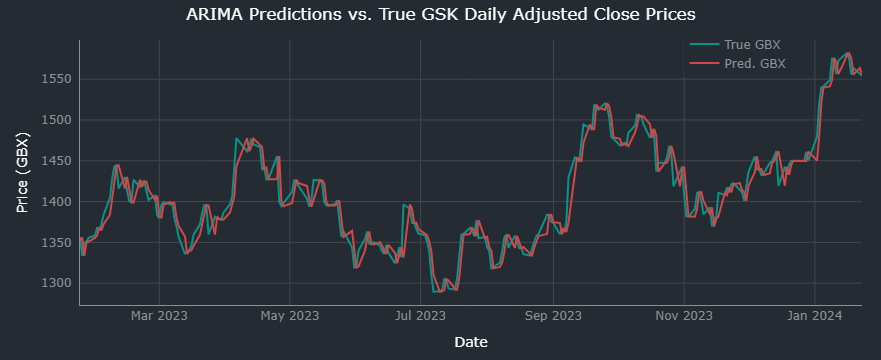

# Tick Predict

## Overview

Tick Predict is a project to explore the predictive power of ARIMA (AutoRegressive Integrated Moving Average) models applied to time series price data. Securities markets are a common focus of predictive machine learning algorithms, since a model able to outperform the market in forecasting future stock price movements would offer potentially lucrative rewards.

ARIMA is computationally inexpensive and easy to interpret, due to the simplicity of the model which can forecast based on relatively small datasets. This contrasts with deep learning forecasting, which is expensive to conduct and requires large volumes of input, and is a "black box" in terms of the difficulty of understanding how predictions are arrived at.

ARIMA is typically limited to univariate data inputs (as in this project) such as stock prices or sales volumes. The algorithm's simplicity makes it a less sophisticated approach best used for short-term predictions.

## Data collection

The analysis below uses price data exported from the [Yahoo! Finance](https://finance.yahoo.com/) website.

The two securities examined are shares for [GlaxoSmithKline](https://finance.yahoo.com/quote/GSK.L?p=GSK.L&.tsrc=fin-srch) (GSK), a major UK pharmaceutical company and FTSE 100 component listed on the London Stock Exchange; and [TBIL](https://finance.yahoo.com/quote/TBIL?p=TBIL&.tsrc=fin-srch), an Exchange Traded Fund (ETF) that tracks the price of US Treasury three month bills.

The GSK dataset contains daily price data for a five year period up to (and not including) 24 January 2024. The TBIL dataset contains daily prices from its launch on 9 August 2022 to 24 January 2024.

## ARIMA model

For ARIMA models, p, d, and q represent the orders of the AR (AutoRegressive), I (integrated), and MA (Moving Average) components, respectively.

- p (AR order): the number of lagged observations included in the model, and therefore the influence of past values on the current value; e.g., p=2 would consider the two most recent values.
- d (Integration order): the order of "differencing" needed to make the time series stationary. Differencing involves subtracting the previous value from the current one; e.g., d=1 would take the difference of the current value subtracted from the previous value.
- q (MA order): the number of past forecast errors included in the model. This captures short-term fluctuations that are not captured by the AutoRegressive component. If q=1, only the most recent error is considered; e.g., if q=2, the two most recent errors are considered.

Standard notation for ARIMA models is ARIMA(p,d,q), where ARIMA(1,1,1) would represent an order of 1 for each component.

This project makes use of the pmdarima Python library's auto_arima function to identify the optimal (p,d,q) values, and autocorrelation plots generated using the pandas Python library's autocorrelation_plot function.

A systematic approach would be to perform a grid search across a custom range of values, rather than rely on the (p,d,q) values suggested by the auto_arima function.

Code to perform this grid search is contained in the image below.

In practice, performing the grid search on even a small range of values was too time-expensive on my machine; I opted to use the auto_arima recommendations, but with limited trial and error on low values of p to find the best fit.

## GSK

The forecast used for GSK stock prices derives from the adjusted close prices. The adjusted close price is preferred for ARIMA models relative to the original close price, because it better coheres with the ARIMA model's assumption of stationarity - that features such as mean and variance remain constant over time. Yahoo! Finance's adjusted close figures are calculated to account for stock splits and dividend payments.

### Daily adjusted close

Time series data for the GSK daily adjusted close price and trade volume is displayed below; prices are in GBX (pence sterling, 1/100th of a British pound sterling).

The adjusted close price shows a general upward trend over time, but with considerable fluctuation around the mean as indicated by the dotted line. No clear pattern emerges from the data.

The trade volume data remains relatively constant throughout the five years, with regular spikes every few weeks and months.

### Hyperparameter tuning

The auto_arima function identified optimal (p,d,q) values as follows:

The auto_arima function identified optimal (p,d,q) values of ARIMA(0,1,0), which is equivalent to a random walk. The prediction equation can be expressed as: Xt = Xt-1 + εt, where t represents the time period, and ε captures random noise.

Pandas' in-built autocorrelation plot can also be used to determine a suitable value for p (AR order), by identifying the highest lag value at which the data still exhibits a strong correlation:

The solid lines (green) either side of the central solid line (blue) represent the 95% confidence interval - values outside of this range may be considered statistically significant. The dashed lines (grey) are two standard errors above and below the central line (y=0) (i.e., the 99% confidence bands) and demarcate the range within which correlation could be due to random chance.

The plot displayed above shows a strong correlation for the first 10 or so lag values. We can test a value of 10 for our AR value to incorporate recent values, to see how this performs compared with pmdarima's auto_arima suggestion of 0.

### Model implementation

Most machine learning applications involve splitting data into train and test sets, so that the model can first be trained on a corpus of data, and then tested on previously unseen data.

Strictly speaking this is not necessary with time series models, because for rolling forecasts, with each prediction the model is retrained with the additional data generated in that time step (in this case, days).

However, it can still be useful to apply the concept of train and test sets; the purpose of this project is to explore the predictive capabilities of ARIMA, so we can train the model on the first 80% of data, then evaluate performance on the unseen 20%.

The ARIMA(0,1,0) order achieved root mean squared error (RMSE) and r-squared (R2) values as follows:

For comparison, the ARIMA(10,1,0) model results are shown below.

Notably, the ARIMA(10,1,0) model is not far behind the optimal model. The optimal model achieved RMSE of 15.64, versus ARIMA(10,1,0)'s 15.79, and the R2 values matched.

The ARIMA(0,1,0) significantly outperformed in terms of computational expense, however: it took less than five seconds to complete, compared with ARIMA(10,1,0)'s runtime of around two minutes.

RMSE is a useful measure, since it converts the mean squared error (average difference between predicted values and the true values) back to the original unit - in this case, GBX. So, the ARIMA(0,1,0) model's RMSE of 15.64 indicates a mean prediction error of GBX15.64.

An RMSE of GBX15.64 appears reasonable, since the minimum and maximum adjusted close values in the dataset are GBX1,045.53 and GBX1,859.88, respectively. At those extremes, GBX15.64 equates to errors of approximately 1.5% and 0.85%.

The R2 value, meanwhile, indicates that the 94% of the variation in the dependent variable (the predicted price) is explained by the independent variable (the price history).

The figure below plots the predicted (red) and true (green) values as evaluated on the test set.

## TBIL

TBIL is the ticker for the US Treasury 3 Month Bill ETF, which has tracked the price of three-month US Treasury Bills since its launch in 2022.

### Daily close and adjusted close

TBIL exhibits a strong price pattern of minor fluctuations within short cycles.

Since TBIL has a much different profile to GSK, it will be interesting to the compare performance of ARIMA applied to the TBIL Close Price (cyclical) and Adj Close Price.

The figure below depicts the daily close price (blue, left-hand y-axis) and adjusted close price (red, right-hand y-axis) in the top plot, and daily trade volume (green) in the bottom plot.

The difference with the GSK time series is striking. In blue, we can observe the cyclical nature of close prices - a consequence of regular dividend payments - while in red, the adjusted close price can be seen to grow at an apparent constant rate over time.

Again in contrast to the GSK time series, the trade volume for TBIL shows growth over time rather than a constant (but volatile) trend.

### Hyperparameter tuning

The auto_arima function identified optimal (p,d,q) values as follows:

The optimal (p,d,q) values of (3,2,1) diverge markedly from GSK's random walk. Here, recent observations are now directly incorporated via the autoregressive (AR) value of 3, and past errors also feature more prominently with the q value (MA, moving average) of 1.

The auto_arima function further displays statistical analysis of the model as follows:

The AR intercepts (ar.L1, ar.L2, and ar.L3) have negative values, which indicates that past observations have suppressing effect on the current value: a high value would lead to a low value, and vice versa.

The high negative MA value (-0.9492) indicates that the model features strong correction for past errors, with quick adjustments in the opposite direction of the errors. A positive error at t-1 would drive down the value at t.

The autocorrelation plot is displayed in the figure below.

The smooth initial descent of the curve (red) reinforces the greater importance of past observations to this model, as compared with the steep drop shown in the GSK autocorrelation plot.

### Model implementation

The ARIMA(3,2,1) order achieved root mean squared error (RMSE) of 0.01, and r-squared (R2) of 1.0.

The plot of the true and predicted adjusted price figures reveal this to be a highly linear relationship. The greater accuracy of the model's predictions is in line with the considerable simplicity of the time series, and differs starkly from the trends exhibited by the GSK adjusted close time series.

## Acknowledgements

### Data

- Yahoo! Finance: [GSK.L](https://finance.yahoo.com/quote/GSK.L?p=GSK.L&.tsrc=fin-srch)
- Yahoo! Finance: [TBIL](https://finance.yahoo.com/quote/TBIL?p=TBIL&.tsrc=fin-srch)

### Libraries

- ARIMA model: [statsmodels](https://www.statsmodels.org/stable/generated/statsmodels.tsa.arima.model.ARIMA.html)
- Autocorrelation plot: [pandas](https://pandas.pydata.org/docs/reference/api/pandas.plotting.autocorrelation_plot.html)
- Data visualisation: [Plotly](https://plotly.com/python/)
- Hyperparameter tuning: [pmdarima](https://pypi.org/project/pmdarima/)
- Performance metrics: [scikit-learn](https://scikit-learn.org/stable/index.html)

### Sources

- Jason Brownlee, Machine Learning Mastery: "[How to Create an ARIMA Model for Time Series Forecasting in Python](https://machinelearningmastery.com/arima-for-time-series-forecasting-with-python/)"
- Jason Brownlee, Machine Learning Mastery: "[How to Grid Search ARIMA Model Hyperparameters with Python](https://machinelearningmastery.com/grid-search-arima-hyperparameters-with-python/)"
- Robert Nau, Duke University: "[Introduction to ARIMA: nonseasonal models](https://people.duke.edu/~rnau/411arim.htm)"
- Selene Yue Xu, University of California, Berkeley: "[Stock Price Forecasting Using Information from Yahoo Finance and Google Trend](https://www.econ.berkeley.edu/sites/default/files/Selene%20Yue%20Xu.pdf)"
